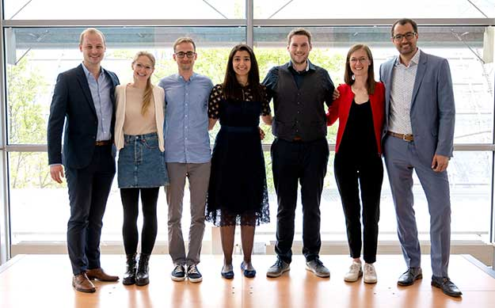

Wir sind ein Zusammenschluss junger Nukis und wir glühen für unser Fach! :-)

### Wie alles begann ...

Unsere Initiative entstand im Rahmen der von der DGN angestoßenen Task Force „Zukunft Nuklearmedizin“. Die Young DGN Initiative geht letztlich auf den vielfachen Wunsch nach der Gründung einer eigenen DGN-Nachwuchsorganisation zurück. Here we are!

Eine der Stärken unseres Fachs ist die bereits im klinischen Alltag gelebte Interdisziplinarität. Auch bei der Young DGN Initiative legen wir hohen Wert auf den interdisziplinären Schulterschluss! Unsere Türen stehen offen sowohl für ärztliches Personal, MTAs, Studierende und Auszubildende, die Naturwissenschaften, die Radiopharmazie, die Medizinphysik als auch für anderweitige Interessierte.

Gründungssteam (links nach rechts): A. Holzgreve, F. Eilsberger, E. Einspänner, A. Sahin, J. Kunz, S. Spreckelmeyer, B. Kläsner
